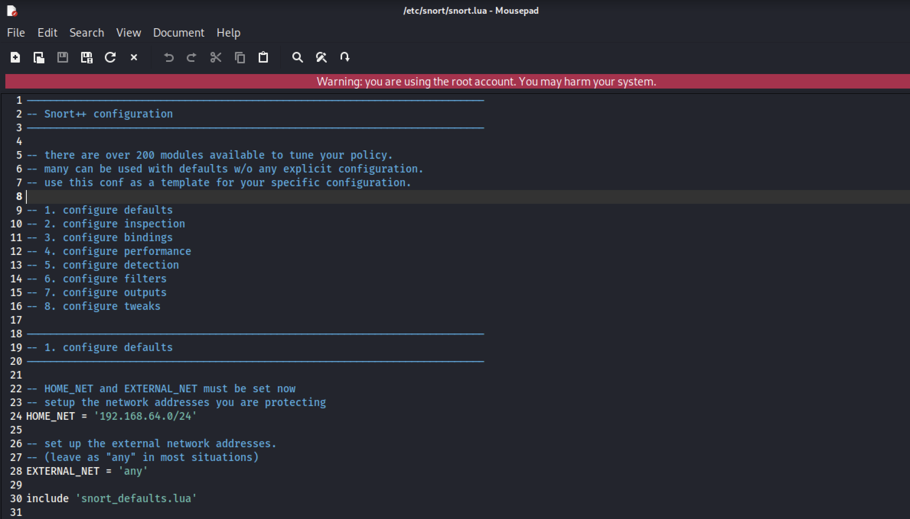
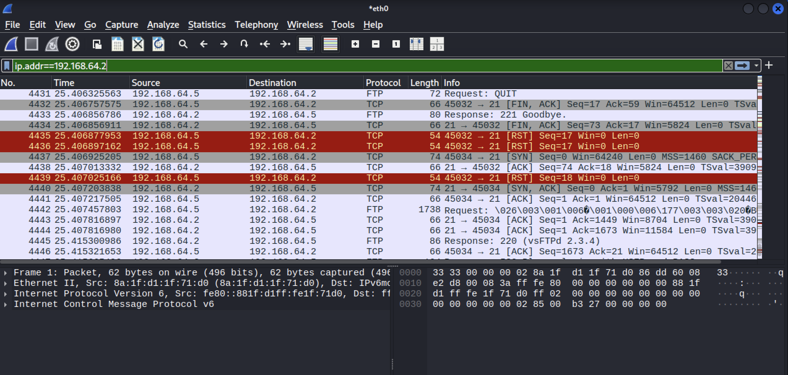

# **Lab 8 Report**  
##### CSCY 4742: Cybersecurity Programming and Analytics, Spring 2026

**Name & Student ID**: John Paul Bennett Jr., 110412273

---

# **Task 1: Snort Setup and Basic Packet Capture (20 pts)**

---

## **🔹 Step 1: Snort Installation and Configuration**

### **Questions**:
1. How many rules were loaded when Snort started? What does this number tell you about the configuration?
- Answer: At least 10000 rules were loaded when Snort started. Regardign the configuration, this number of rules processed tells me how much coverage the detection system has with regards to detecting intrusions. The number is way more than a couple thousand, being in the ten thousands, which means that the intrusion detection system covers a broad range of protocols, threats and attack types.

2. Did Snort report any warnings or errors during startup? Explain.
- Answer: The program did not report any errors or warnings during startup. I know because when I pressed the control key and the "C" key, the program said "Snort exiting" which is a sign that the program works well. In addition, it is able to detect detection attacks run by a virtual machine against another machine.

3. What interface did Snort bind to? Was it the expected one? Why is selecting the correct interface important?
- Answer: The program binded to the Eth0 interface, which was the expected one. Selecting the correct interface is important because different interfaces see different network traffic. If Snort was binded to the incorrect interface, it might miss network attacks due to not seeing the network traffic because the traffic is on the interface other than the one Snort was binded to.

4. What output mode was used (`alert_fast`, etc.)? Briefly explain differences between modes and appropriate use cases.
- Answer: 'alert_fast' was used. This output mode returns an alert line quickly. Other output modes like 'full' mode log the alerts with detailed information and is the default mode of snort. 'alert_syslog' logs the alert outputs to a syslog server or system logging system. The difference between modes is based on how they present alert outputs and whether or not the alerts are logged to syslog servers.

### **Screenshots**:
- Screenshot of successful Snort startup (`Snort successfully validated the configuration`).

- Screenshot of `snort.lua` showing updated `HOME_NET`.

---

## **🔹 Step 2: Simulating and Detecting a Port Scan**

### **Questions**:
1. What types of scan activity did Snort detect from the Nmap scan? Provide examples.
- Answer: Snort detected SYN stealth scan activity from the Nmap scan. An example was http_inspect which means the stealth scan was checking for a service.

2. Which ports or protocols were probed by Nmap? Mention a few and their significance.
- Answer: Ports 21 and 80 were probed by Nmap. Port 80 is the TCP

3. How did promiscuous mode help in detection?
4. Compare Snort alerts and Wireshark output. What extra insights does Wireshark provide?

### **Screenshots**:
- Snort console showing scan-related alerts.

- Wireshark packet capture showing SYN scan activity.

---

# **Task 2: Writing Custom Rules – ICMP, FIN, NULL, and Xmas Scan Detection (20 pts)**

---

## **Deliverables for Task 2**

### **Questions**:
1. Why are FIN, NULL, and Xmas scans considered stealthy compared to normal TCP scans?
2. What do the flags `F`, `0`, and `FPU` represent in these rules?
3. Compare Snort detection with Wireshark TCP flag analysis.
4. What `classtype` would you select for these rules and why?

### **Screenshots**:
- Snort alert showing ICMP detection.
- Snort alerts for FIN, NULL, and Xmas scans.
- Wireshark TCP flag views for one FIN, one NULL, and one Xmas packet.

---

# **Task 3: FTP Login and Brute Force Detection (20 pts)**

---

## **Deliverables for Task 3**

### **Questions**:
1. What does the `"530 "` FTP response indicate, and why is it useful for detection?
2. Why is `flow:from_server,established` needed for failed login detection?
3. Explain `detection_filter:track by_src, count 3, seconds 60;` and how it works.
4. How does thresholding (`detection_filter`) help reduce alert fatigue?
5. How would you improve the FTP detection rules for a production deployment?

### **Screenshots**:
- Snort alert for FTP connection attempt.
- Snort alert for FTP failed login.
- Snort alert for FTP brute force detection.

---

# **Task 4: Sensitive Data Exfiltration Detection via FTP (20 pts)**

---

## **Deliverables for Task 4**

### **Questions**:
1. Why is regex (PCRE) used instead of simple content matching for SSN detection?
2. Why is FTP considered dangerous for transmitting sensitive data like SSNs?
3. How could attackers exploit anonymous FTP servers?
4. How would detection change if traffic were encrypted (SSH, FTPS, SFTP)?

### **Screenshots**:
- Snort alert triggered for SSN leak detection.
- Wireshark capture showing SSN pattern during file transfer.

---

# **Task 5: SYN Flood Detection and Thresholding (20 pts)**

---

## **Deliverables for Task 5**

### **Questions**:
1. Why is `detection_filter` important for detecting SYN floods?
2. Why is `event_filter` important? What happens if we do not define this?
3. How would using `--rand-source` affect Snort’s detection?
4. Why can't Snort itself block SYN floods directly?
5. How could a firewall or IPS help defend against SYN floods?

### **Screenshots**:
- Snort alert showing SYN flood detection.
- Screenshot of `local.rules` containing the correct SYN flood rule.
- Screenshot of `snort.lua` showing the correct `event_filter`.

